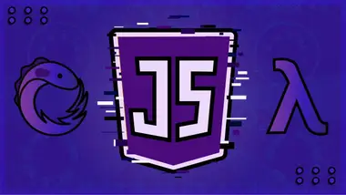

<h1 align="center">Curso Javascript Funcional e reativo</h1>
<h2 align="center">Pense como um Dev JS!</h2>

    

 
:arrow_right: 
Esse é um repositório dos arquivos gerados durante o curso ministrado pelo professor leonardo Leitão da C0d3r.

